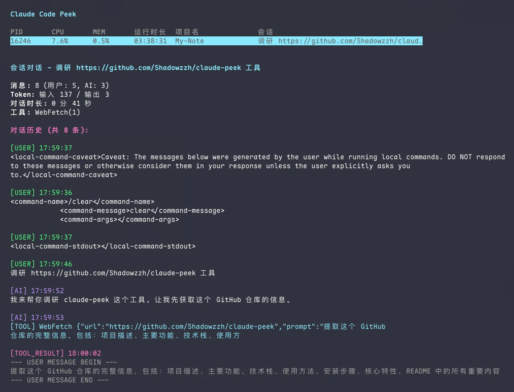
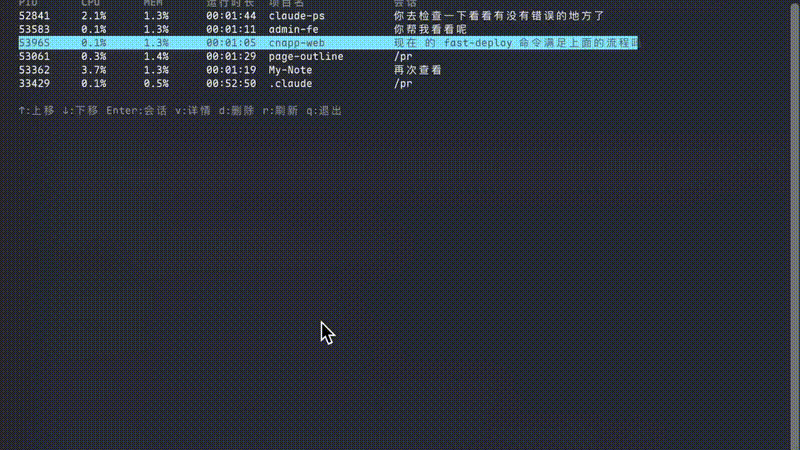
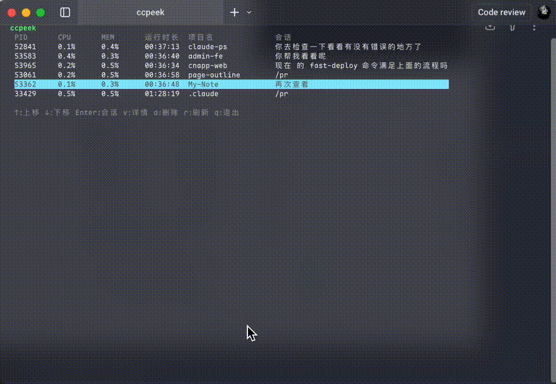

<h1 align="center">ccpeek</h1>

<div align="center">

**Claude Code Process/Session Inspector**


[English](./README.md) | [简体中文](./README.zh-CN.md)


*See all processes at a glance, view conversations quickly, kill stuck instances with one key*

[Quick Start](#quick-start) • [Features](#features) • [Commands](#commands) • [How It Works](#how-it-works) • [Who Needs This](#who-needs-this) • [Privacy & Safety](#privacy--safety) • [FAQ](#faq) • [Troubleshooting](#troubleshooting) • [Uninstall](#uninstall) • [Roadmap](#roadmap)

</div>

<p align="center">
    
</p>


## Why ccpeek?

Running multiple Claude Code sessions? You know the pain:

* Can't tell what's running - `ps`/`top` shows PIDs, not what they're doing
* Messy session hunting - Digging through `~/.claude/projects/` is slow
* No quick cleanup - Can't easily kill stuck instances

**ccpeek puts process info, session messages, and cleanup in one terminal UI.**

## Quick Start

```bash
npm install -g @zhangziheng/claude-peek
ccpeek setup
ccpeek
```

## Features

* List all Claude Code processes with project paths
* View live session messages in terminal
* Kill stuck instances directly
* Browse history by project after process ends
* Export conversations to Markdown

## Commands

### Interactive Mode

```bash
ccpeek
```

**Keybindings:**
- `↑/k` `↓/j` - Navigate
- `Enter` - View session messages
- `v` - View process details
- `d` - Kill process
- `r` - Refresh
- `q/Esc` - Quit

**View Process Details:**

<p align="center">
    
</p>

**View Session Messages:**

<p align="center">
    
</p>

### CLI Mode

```bash
ccpeek list              # List all processes
ccpeek list --json       # JSON output
ccpeek show <pid>        # Show process details
ccpeek messages <pid>    # View session messages
ccpeek kill <pid>        # Kill process
```

**Messages command supports:**

```bash
# By PID (running process)
ccpeek messages 12345

# By project path (running or history)
ccpeek messages /path/to/project

# By session ID
ccpeek messages /path/to/project abc123-session-id
```

**Output options:**

```bash
ccpeek messages 12345           # Terminal output
ccpeek messages 12345 --md      # Markdown to stdout
ccpeek messages 12345 --save    # Save to file
ccpeek messages 12345 --copy    # Copy to clipboard
```

## How It Works

ccpeek uses Claude Code hooks to map `PID ↔ SessionID`, then reads session data from `~/.claude/projects/`.

**Flow:**
1. SessionStart hook captures PID and SessionID
2. Mapping stored in `~/.claude/ccpeek/session-mappings.jsonl`
3. ccpeek reads process list + mappings + session files

## Who Needs This

* Running multiple Claude Code instances
* Working on remote servers via SSH
* Heavy agent workflow users
* Terminal/TUI enthusiasts

## Privacy & Safety

```
[✓] Local only    - Reads only ~/.claude files
[✓] No uploads    - Zero data sent anywhere
[✓] Minimal hooks - Only logs PID/SessionID mapping
[✓] Easy removal  - ccpeek uninstall cleans everything
```

## FAQ

**Q: Will it modify my Claude Code config?**
A: Only adds hooks to `.claude/hooks/`. Your config stays untouched.

**Q: Can I see sessions after process ends?**
A: Yes, use `ccpeek messages /path/to/project`

**Q: What if hooks fail to install?**
A: ccpeek still works for existing sessions, just can't track new PIDs.

**Q: Does it work on remote servers?**
A: Yes, as long as Claude Code runs there.

## Troubleshooting

**Hook installation fails:**
```bash
# Check Claude Code directory
ls ~/.claude/hooks/

# Reinstall
ccpeek uninstall
ccpeek setup
```

**Can't find sessions:**
```bash
# Verify session files exist
ls ~/.claude/projects/

# Check mappings
cat ~/.claude/ccpeek/session-mappings.jsonl
```

**Permission denied:**
```bash
# Fix permissions
chmod +x ~/.claude/hooks/*.sh
```

## Uninstall

```bash
ccpeek uninstall
npm uninstall -g @zhangziheng/claude-peek
```

## Roadmap

- [ ] Remote machine support

## License

MIT
